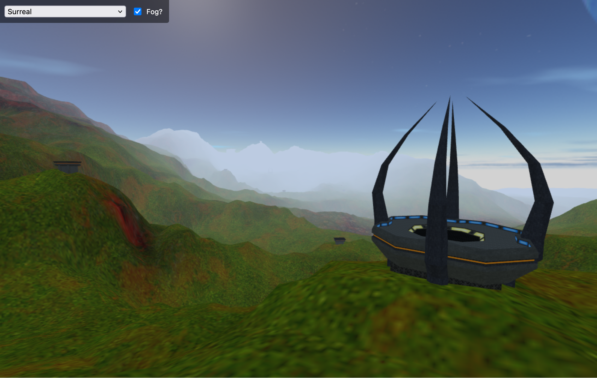

#  MapGenius&trade;

## Map inspector for Tribes 2.



## Development

Install dependencies:

```console
npm install
```

Run the dev server:

```console
npm start
```

### Running scripts

[tsx](https://tsx.is) is included to run TypeScript files directly.

Example:

```console
tsx scripts/generate-manifest.ts
```
