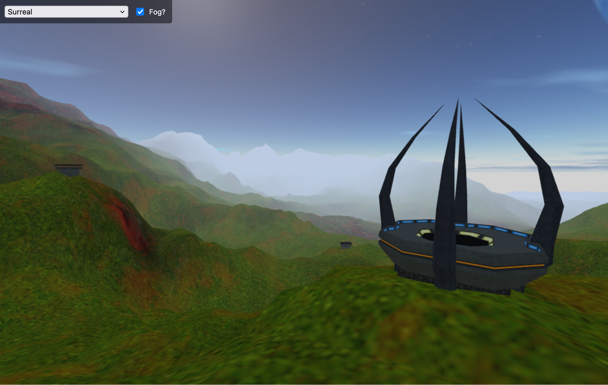

#  MapGenius&trade;

## Map inspector for Tribes 2.



## Usage

👉 **[Open the app!](https://exogen.github.io/t2-mapper/)**

### Camera Controls

Click inside the map preview area to capture the mouse.

| Key | Action |
|-----|--------|
| <kbd>W</kbd> | Forward |
| <kbd>A</kbd> | Left |
| <kbd>S</kbd> | Backward |
| <kbd>D</kbd> | Right |
| <kbd>Space</kbd> | Up |
| <kbd>Shift</kbd> | Down |
| <kbd>Esc</kbd> | Release mouse |
| <small>Left click</small> | Next observer camera |
| △ <small>Scroll/mouse wheel up</small> | Increase speed |
| ▽ <small>Scroll/mouse wheel down</small> | Decrease speed |


## Development

Install dependencies:

```console
npm install
```

Run the dev server:

```console
npm start
```

### Running scripts

[tsx](https://tsx.is) is included to run TypeScript files directly.

Example:

```console
tsx scripts/generate-manifest.ts
```
